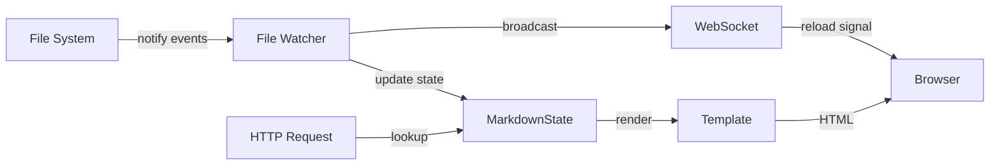
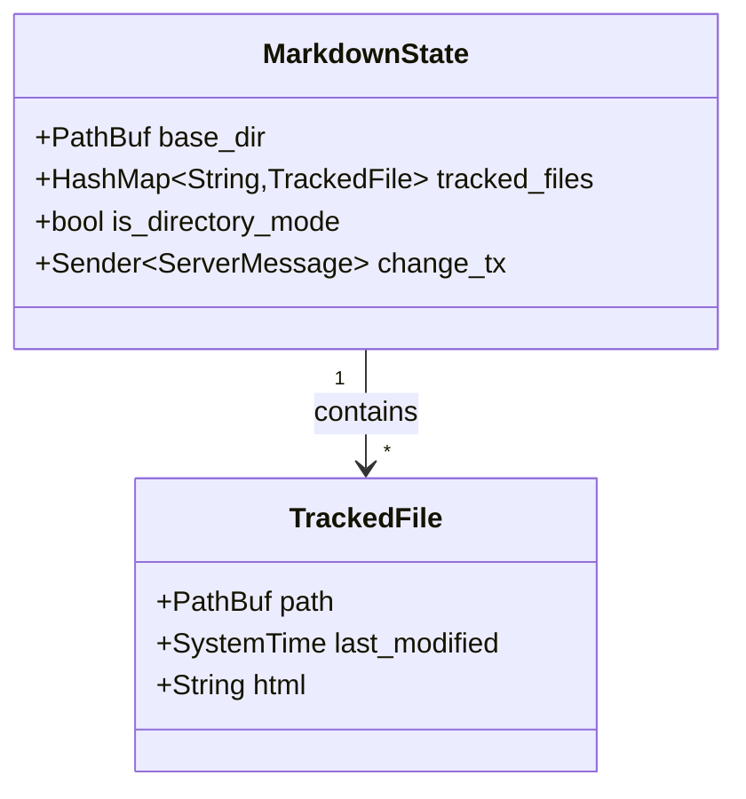

# mdserve Architecture

## Overview

mdserve is a simple HTTP server for markdown preview with live reload. It supports both single-file and directory modes with a unified codebase.

**Core principle**: Always work with a base directory and a list of tracked files (1 or more).



## Modes

### Single-File Mode
```bash
mdserve README.md
```
- Watches parent directory
- Tracks single file
- No navigation sidebar

### Directory Mode
```bash
mdserve ./docs/
```
- Watches specified directory
- Tracks all `.md` and `.markdown` files
- Shows navigation sidebar

## Architecture

### State Management

Central state stores:
- Base directory path
- HashMap of tracked files (base-directory-relative path → metadata + pre-rendered HTML)
- Directory mode flag (determines UI)
- WebSocket broadcast channel



Mode is determined by user intent, not file count:
- `mdserve /docs/` with 1 file shows sidebar
- `mdserve single.md` never shows sidebar

**Example states:**

Single-file mode:
```
base_dir = /path/to/docs/
tracked_files = {
  "README.md": TrackedFile { ... }
}
is_directory_mode = false
```

Directory mode (recursive):
```
base_dir = /path/to/docs/
tracked_files = {
  "api.md": TrackedFile { ... },
  "guide.md": TrackedFile { ... },
  "reference/errors.md": TrackedFile { ... },
  "README.md": TrackedFile { ... }
}
is_directory_mode = true
```

### Background Scanning

In directory mode the server starts with no tracked files and walks the tree on
a blocking task, rendering and inserting each markdown file as it is found. The
growing file list is broadcast to clients at most once every 100ms
(`SCAN_UPDATE_INTERVAL`), with a final message when the walk finishes. Indexing
a tree of thousands of files therefore never delays the first response.

`GET /` before the first file is found returns a live placeholder page ("Scanning
for markdown files…", or "No markdown files found." once the walk is done) marked
with `data-awaiting-files`; the client reloads it as soon as the list is
non-empty. An empty directory is a page, not a startup error.

The walk drops ignore files *above* the served directory when they would exclude
it (`ignored_by_ancestor`), so naming a directory on the command line overrides a
parent `.gitignore`. Ignore files inside the served tree still apply.

### Live Reload

Uses [notify](https://github.com/notify-rs/notify) crate to watch the base directory (recursively by default, or non-recursively with `--no-recursive`):
- Create/modify: Refresh file, add if new (directory mode only)
- Delete: Remove from tracking
- Rename: Remove old, add new
- All changes trigger a WebSocket broadcast

File changes flow:
1. File system event detected by `notify`
2. Markdown re-rendered to HTML
3. State updated (refresh/add/remove tracked file)
4. Broadcast via WebSocket channel: `ServerMessage::Reload` when a tracked file's
   content changed, or `ServerMessage::Files` when only the set of files did
5. All connected clients receive the message
6. Clients execute `window.location.reload()`, or rebuild the sidebar in place
   for `Files` — a new file must not throw away the page being read

### Routing

Single unified router handles both modes:
- `GET /` → First file alphabetically
- `GET /*path.md` → Specific markdown file, keyed by its path relative to the base directory (e.g. `sub/dir/notes.md`)
- `GET /*path.<ext>` → Images from the base directory (including subdirectories)
- `GET /ws` → WebSocket connection
- `GET /mermaid.min.js` → Bundled Mermaid library
- `GET /api/download` → Offline bundle zip (see below)

Tracked files are keyed by their base-directory-relative path, so the wildcard
`*path` route can address files in subdirectories. Directory traversal is
prevented not by rejecting `/`, but because markdown requests must match a
tracked-file key and image requests are canonicalized and checked to remain
within the base directory.

### Rendering

Markdown is rendered to HTML with [markdown-rs](https://github.com/wooorm/markdown-rs); rendered headings then get GitHub-style slug `id` attributes so in-page `#anchor` links resolve, both in the live preview and the offline bundle.

The page is assembled with [MiniJinja](https://github.com/mitsuhiko/minijinja) (Jinja2 template syntax) with templates embedded at compile time via [minijinja_embed](https://github.com/mitsuhiko/minijinja/tree/main/minijinja-embed).

Conditional template rendering:
- Directory mode: Includes navigation sidebar with active file highlighting
- Single-file mode: Content only
- Both use same pre-rendered HTML from state

Template variables:
- `content`: Pre-rendered markdown HTML
- `mermaid_enabled`: Boolean flag, conditionally includes Mermaid.js when diagrams detected
- `show_navigation`: Controls sidebar visibility
- `files`: List of tracked files (directory mode)
- `current_file`: Active file name (directory mode)
- `awaiting_files`: Marks the placeholder page shown before any file is indexed

### Offline bundle (`src/bundle.rs`)

`GET /api/download` produces a self-contained `.zip` (built in a `spawn_blocking`
task). Each tracked markdown file is rendered to an offline page via
`render_bundle_page`; pages reference a single shared copy of the mermaid/panzoom
libraries written under `_assets/` (relative `../` paths per page depth) rather
than inlining them, so many-diagram bundles stay small.
A BFS walk over the rendered HTML's `href`/`src` attributes discovers local
dependencies, classifies them (external URLs left untouched; relative/absolute/
`file://` paths bundled), resolves them to canonical paths, and follows linked
`.md` files transitively (visited-set dedup; `MAX_FILES`/`MAX_TOTAL_BYTES` caps).
Files inside `base_dir` mirror their relative path (markdown → `.html`); files
outside go under `_external/<sanitized-absolute-path>`. Links are then rewritten
in each page's HTML to bundled relative paths. Directory mode also emits a
generated `index.html`. Collecting dependencies outside `base_dir` is allowed
only on loopback binds (`127.0.0.1`/`::1`/`localhost`); when bound to a network
interface (`--hostname 0.0.0.0`) the walk stays within `base_dir`, so a remote
client can't pull arbitrary local files. The endpoint also rejects cross-origin
requests (an `Origin` not matching `Host`) to stop a visited web page from
reading the bundle via the permissive CORS layer. `allow_dangerous_protocol`
(needed so `file://` links survive rendering for collection) is scoped to the
bundle renderer; the live preview keeps the stricter sanitization. Uses the
[`zip`](https://docs.rs/zip) crate (pure-Rust `miniz_oxide` DEFLATE).

## Design Decisions

**Unified architecture**: Single code path handles both single-file and directory modes. Mode determined by user intent, not file count.

**Pre-rendered caching**: All tracked files rendered to HTML in memory as they are discovered and on file change. Serving always from memory, never from disk.

**Recursive watching by default**: Subdirectories are scanned and watched, using the [`ignore`](https://docs.rs/ignore) crate to honor `.gitignore`/`.ignore` rules and skip hidden directories. `--no-recursive` limits this to the immediate directory.

**Explicit paths outrank parent ignore rules**: Passing a directory is a request to serve it, so a `.gitignore` above it is not consulted for the walk. This keeps the common `mdserve tasks/emails` case working in repos that ignore `tasks/`, while ignore files inside the served tree still take effect.

**Scan in the background**: Serving starts immediately and the file list streams to clients, rather than making startup wait on a full walk. The cost is that a file can 404 briefly before the scan reaches it.

**Server-side logic**: Most logic lives server-side (markdown rendering, file tracking, navigation, active file highlighting, live reload triggering). Client-side JavaScript stays small (theme management, reload execution, sidebar list updates).

## Constraints

- Recursive by default (`--no-recursive` for flat directories only)
- Alphabetical file ordering only (by relative path)
- All files pre-rendered in memory
